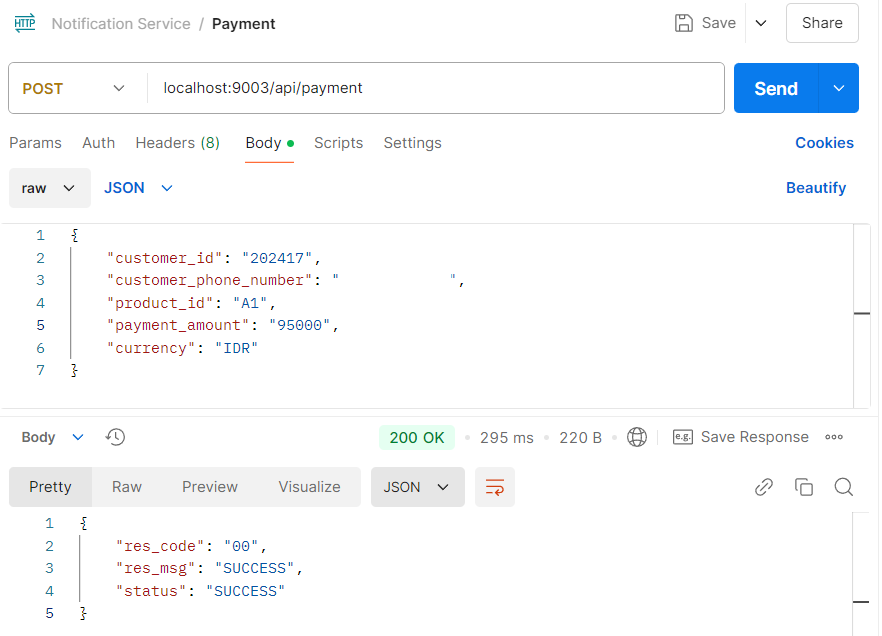
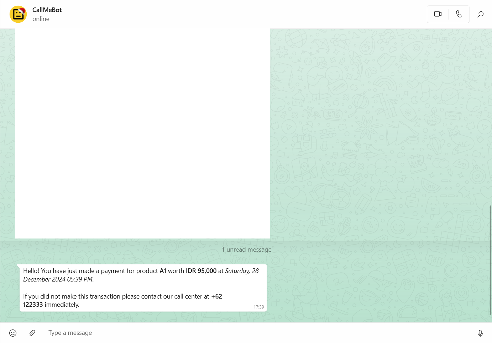

# whatsapp-notification-service
*Be in the know, don't miss a thing!*  
This project is developed in Java and showcases the integration 
of [NATS](https://nats.io/) and the [CallMeBot API](https://www.callmebot.com) 
to deliver payment notifications through WhatsApp.

This project consists of two services: *Payment* and *Notification*. 
The Payment service publishes payment data to NATS, while the Notification
service subscribes to the data and sends a WhatsApp notification as soon 
as new payment information is received.

- Payment Service  

- WhatsApp Notification  

## License
**All rights are reserved.** You may not use, distribute, or modify the code without explicit permission from the author.